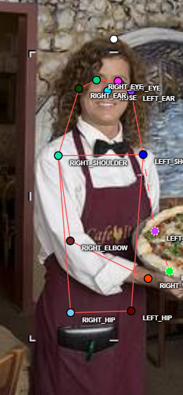
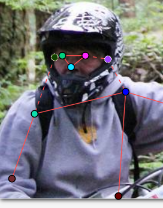
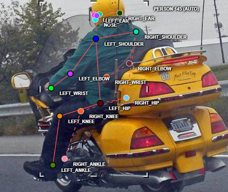
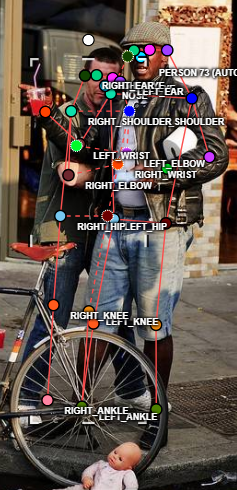
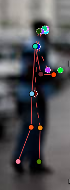
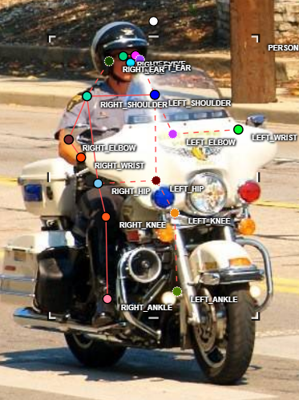
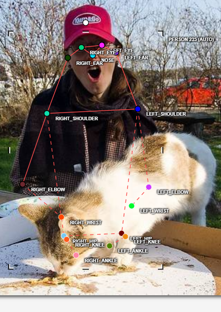

# Mini guideline - nhóm: T020  |  người gán: Hoàng Võ Minh Tuấn  |  ngày: 16/09/2026

> Điền file này **trong lúc** gán nhãn, không phải sau khi xong. Mỗi lần bạn dừng lại
> hơn 10 giây để phân vân, đó là một dòng phải ghi vào đây.

## 1. Luật bắt buộc (đã thống nhất cả lớp - không sửa)

- Bộ 17 điểm COCO, đúng tên, đúng thứ tự. Lấy từ file `.SVG` chung.
- Mọi người trong ảnh đều có **đủ 17 điểm**. Điểm không dùng được thì gắn cờ, không xoá.
- Trái/phải tính theo **cơ thể người**, không theo bức ảnh.
- Bị che, còn trong khung -> `v = 1`, **vẫn đặt chấm** ở vị trí ước lượng.
- Ra ngoài mép ảnh -> `v = 0`, **không** đặt chấm.
- Không dùng `Hidden` (`h`) - nó không được lưu vào file.

## 2. Luật của nhóm bạn (phải điền)

| Tình huống | Luật nhóm bạn chọn | Vì sao |
| --- | --- | --- |
| Hông của người mặc quần áo dài |  Vẫn đánh nhãn bình thường | Không đánh nhãn vì lý do mặc đồ thì nghe nó kì kì |
| Tai bị tóc hoặc mũ bảo hiểm che một phần |  Đánh là bị che | Vì tóc hoặc mũ bảo hiểm che đánh nhãn bình thường là hợp lý |
| Người bị cắt ở mép ảnh (chỉ thấy từ hông trở lên) |  Chỉ đánh những bộ phận cơ thể thấy được | Vì không nên đánh nhãn những thứ mình không thấy |
| Cổ tay nằm sau tay lái / sau thân mình |  Đánh là bị che | Vì nằm sau vật thể gì đó thì nó vẫn tồn tại chứ không phải không có |
| Hai người chồng lên nhau |  Đánh nhãn cả 2 | Vì chồng lên nhau nhưng người sau hoàn toàn không biến mất mà vẫn lộ 1 phần cơ thể ra để có thể nhìn thấy được |
| Người nhỏ đến mức nào thì không gán nữa |  Nhỏ đến mức không nhìn thấy thì không gán nhãn | Vì nhỏ quá không biết khung xương như nào thì không nên đánh nhãn những thứ mình không  |

Với mỗi luật, chèn **một ảnh mẫu** (screenshot từ CVAT) thay vì chỉ viết một câu.
Slide 12 nói rõ: khớp không có bề mặt nhìn thấy được thì phải có ảnh mẫu, không phải
một câu văn chung chung.

## 3. Ba ca mơ hồ đã gặp (bắt buộc, ghi ít nhất 3)

### Ca 1 - ảnh , người thứ `1`, khớp `left-elbow`

- Mơ hồ ở chỗ nào: chỗ khủy tay
- Bạn quyết thế nào: đo khoảng cách từ cổ tay tới khủy tay là bao nhiêu bằng cảm giác
- Vì sao: Vì vai và cổ tay còn thấy rõ, mà chiều dài cẳng tay là đại lượng giải phẫu ổn định (~0.15 × chiều cao người), nên ước lượng từ cổ tay có sai số nhỏ và kiểm chứng được; bỏ khớp thì mất luôn khớp đó khỏi OKS, còn đoán theo mép quần áo thì lệch hệ thống.
- Nếu người khác quyết ngược lại thì model học sai cái gì: 
Nếu người khác bỏ khuỷu trái (không đặt chấm, hoặc gắn v=0 dù tay còn trong khung), model học hai điều sai. Thứ nhất, đầu dự đoán visibility học rằng "tay gập sau thân ⇒ khuỷu không tồn tại", nên ở ảnh test cùng tư thế nó sẽ bỏ luôn khuỷu — đúng cái khớp mình cần nhất. Thứ hai, khớp đó bị loại khỏi phép tính OKS nên không nhận gradient nào, model giữ nguyên prior COCO thay vì học quy ước của lớp. Và vì hai cách gán cùng nằm trong 20 ảnh, cùng một hình dạng tay nhận hai nhãn mâu thuẫn: model chỉ học được trung bình của hai cách, tức khuỷu lơ lửng giữa vị trí giải phẫu và "không có khớp" — sai ở cả hai. Đây cũng là lỗi "xoá khớp bị che", ưu tiên sửa số 4 ở chặng 5, và ngược luật bắt buộc "bị che, còn trong khung → v=1 và vẫn đặt chấm".

### Ca 2 - ảnh , người thứ `2`, khớp ` 
left_hip
right_hip
left_knee
right_knee
left_ankle
right_ankle `

- Mơ hồ ở chỗ nào: 6 khớp dưới (left_hip, right_hip, left_knee, right_knee, left_ankle, right_ankle) — thân dưới không có bề mặt để chấm; mơ hồ giữa bị che và ra ngoài mép ảnh, hai trường hợp cho hai cờ khác nhau.
- Bạn quyết thế nào: tôi quyết định đánh occluded
- Vì sao: Thân trên còn thấy rõ và hướng đùi suy ra được từ khớp hông đối xứng với vai, nên khớp còn trong khung → v=1 và vẫn đặt chấm; nếu đáy ảnh cắt ngang đùi thì ngược lại, v=0 và không đặt chấm.
- Nếu người khác quyết ngược lại thì model học sai cái gì:
Nếu người khác gắn v=0 cho 6 khớp dưới, model học hai điều sai. Thứ nhất, v=0 bị loại khỏi loss keypoint nên 6 khớp đó không dạy model gì cả: gặp người ngồi, model giữ nguyên prior COCO (chân duỗi xuống như người đứng) và dự đoán hông/gối/cổ chân sai hẳn tư thế. Thứ hai, cùng một tư thế ngồi nhận hai nhãn ngược nhau trong 20 ảnh nên model không học được quy ước nào, và ở ảnh test nó do dự đúng ở tư thế khó nhất. Đây là lỗi "xoá khớp bị che" — ưu tiên sửa số 4 ở chặng 5.

### Ca 3 - ảnh , người thứ `3`, khớp `tất cả`

- Mơ hồ ở chỗ nào: Búp bê thì có đánh nhãn không, vì nó có đủ tứ chi và mặt mũi
- Bạn quyết thế nào: Không đánh nhãn
- Vì sao: Vì đây là vật thể mô phỏng, không phải người thật: da nhựa/vinyl bóng đều, không có lỗ chân lông; đầu quá to và cổ liền khối so với thân; tay chân ở tư thế cứng, không có dấu hiệu căng cơ; và kích thước chỉ bằng một phần bánh xe đạp trong khung. Nhóm chốt: chỉ gán person cho người thật trong ảnh, không gán búp bê/ma-nơ-canh/tượng/hình người trên màn hình, poster, gương hay hình in trên áo.
- Nếu người khác quyết ngược lại thì model học sai cái gì:
Ngược lại thì model học sai định nghĩa lớp person: nó coi mọi vật có hình dạng người là người, nên phát hiện cả búp bê, ma-nơ-canh, tượng, hình người trên màn hình — sai ở đầu detect chứ không chỉ ở keypoint. Kèm theo nó học tỉ lệ cơ thể không giải phẫu của búp bê, và vì mẫu sai đó lại dễ học (nằm yên, đối xứng, nét rõ) nên 20 ảnh không đủ để pha loãng nó.

## 4. Sau khi so visibility report với bạn cùng nhóm

- Khớp lệch `%v=1` nhiều nhất: `______` (bạn `___%` / họ `___%`)
- Nguyên nhân là **guideline chưa rõ** hay **một trong hai bên gán sai**:
- Luật mới bổ sung vào mục 2 sau khi thống nhất:
